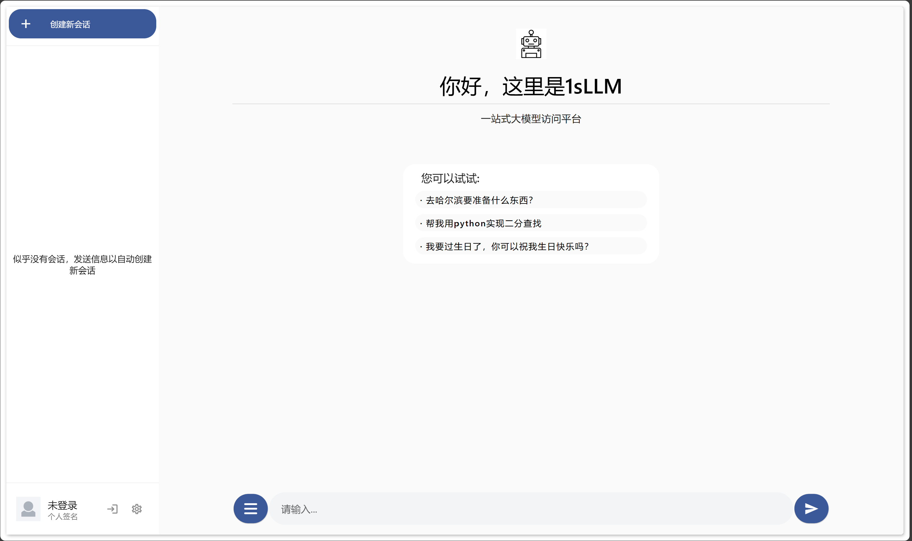
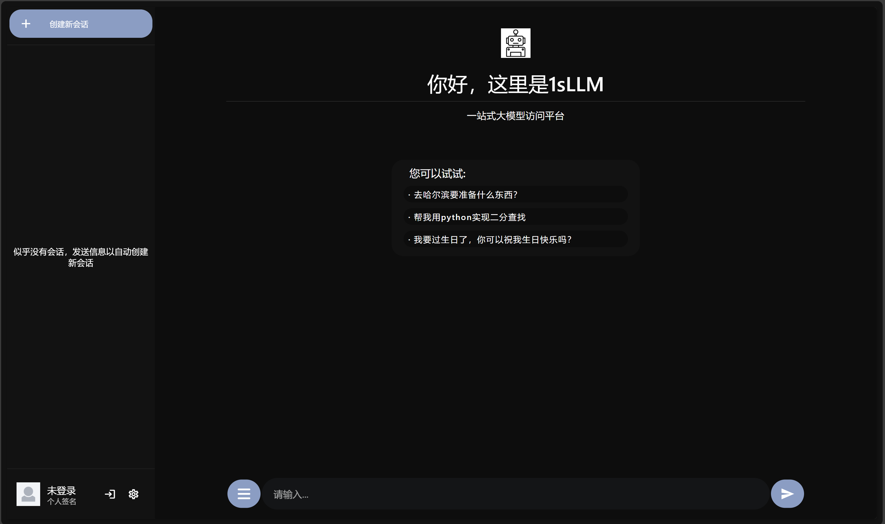
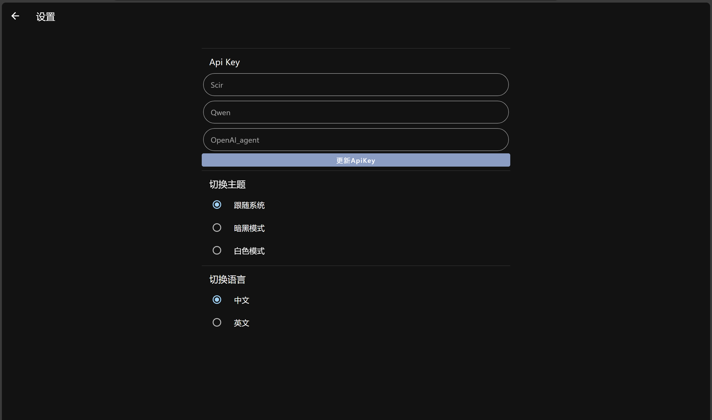
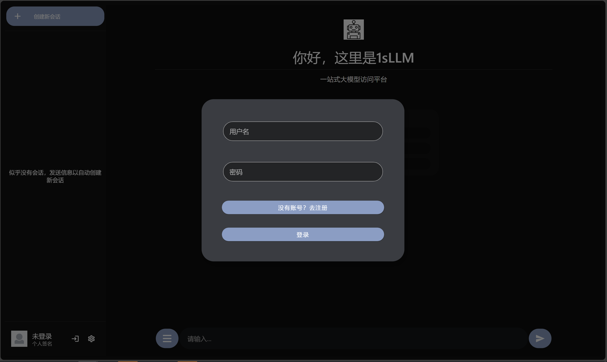
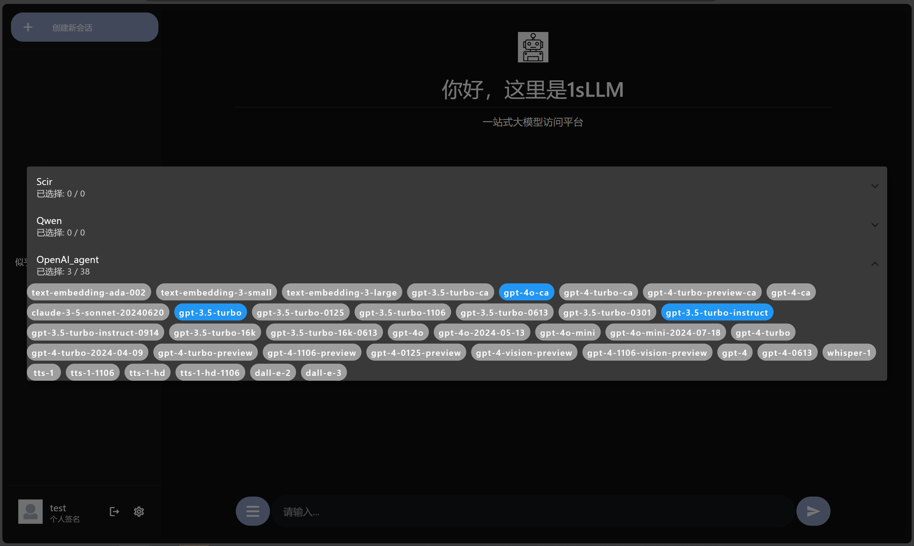
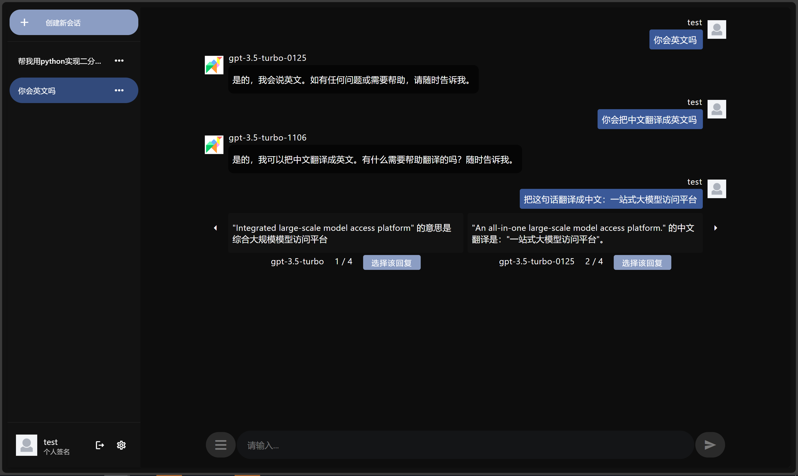
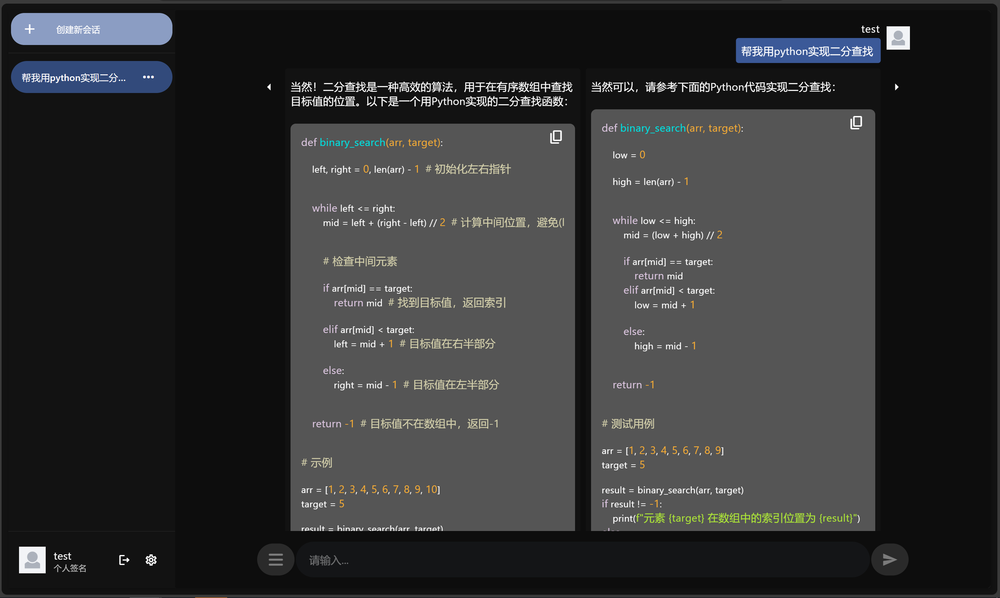

# 1sLLM-frontend

<p style="text-align: center;">
    <a href="https://github.com/XingYuSSS"></a>
    <a href="https://github.com/XingYuSSS/1sLLM-frontend/blob/v0.2.0/CHANGELOG.md"></a>
    <a href="https://github.com/XingYuSSS/1sLLM-frontend"></a>
    <a href="https://github.com/XingYuSSS/1sLLM-backend"></a>
    <a href="https://opensource.org/licenses/MIT"></a>
</p>


这是1sLLM的前端，使用 [flutter](https://docs.flutter.cn/) 编写。

仓库地址：https://github.com/XingYuSSS/1sLLM-frontend

后端地址：https://github.com/XingYuSSS/1sLLM-backend

## 界面展示

### 主页

- 白色模式

 

- 暗黑模式



### 设置页面

 

### 登录弹窗

 

### 模型选择弹窗

 

### 多模型对话

 

### 代码高亮

 

## 实现特性

- [x] 多语言
- [x] latex 解析
- [x] 深色模式
- [x] 多模型对比
- [x] 多用户与对话历史存储
- [x] apikey 管理
- [x] 欢迎页面
- [x] 流式传输
- [x] 单模型对话
- [ ] 自定义 prompt
- [ ] 导出会话

## 运行方式

运行前保证已正确[安装](https://docs.flutter.cn/get-started/install)flutter。

目前已测试平台：

| platform | 本地调试 | 构建发布 |
|:--------:|:-------:|:-------:|
| Android | √ | √ |
| Web     | √ | √ |
| Windows | √ | √ |
| macOs   | × | × |
| iOS     | × | × |
| Linux   | × | × |


不保证未测试平台下的表现。

同时请将`.env`文件中`apiBaseUrl`设置为你所部署后端的路径。

### 本地调试

如果你使用的是 vscode，可以在右下角选择调试设备，并通过点击 `main.dart` 中 `main` 函数上的 run 来运行。

或在终端中使用以下命令进行本地调试
``` shell
flutter run
```
并在终端中选择调试的设备。
### 构建发布
- web端

使用以下命令构建

```shell
flutter build web --web-renderer html
```

打包后的代码位于`./build/web`，运行前请注意调整`./build/web/index.html`中的`<base href="/">`

> 注：如果不指定 web-renderer 为 html 可能导致 edge 无法正常打开，原因未知。

- windows端

使用以下命令构建

```shell
flutter build windows
```

构建后的文件位于`./build/windows/x64/runner/Release/`，该目录中所有文件都是应用文件，请勿删除或移动，双击`ones_llm.exe`启动。

- android端

使用以下命令构建

```shell
flutter build apk --target-platform android-arm,android-arm64,android-x64 --split-per-abi
```

构建后的`.apk`文件位于`.build/app/outputs/flutter-apk`，根据android设备的架构安装对应`.apk`文件（通常为arm64）。

## License: MIT

该项目使用[MIT许可证](LICENSE)。
